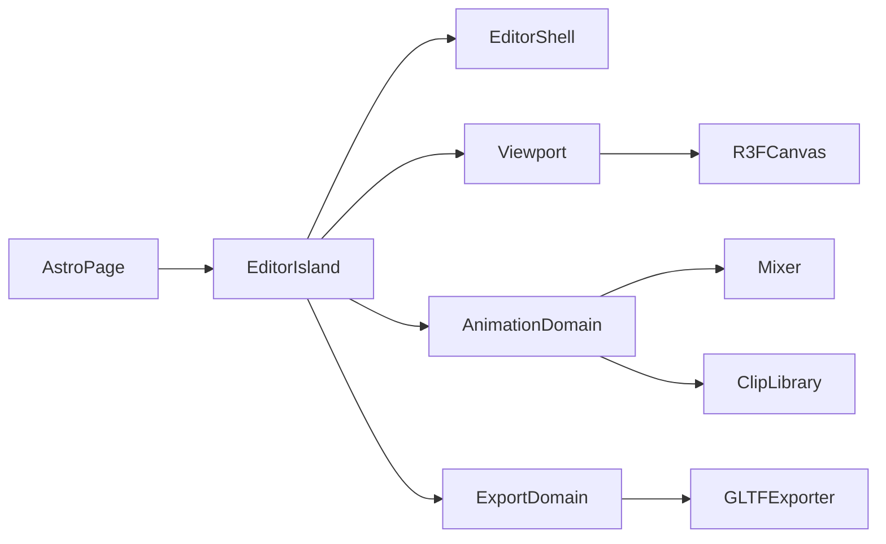

# Design — current

Architecture for the GLB Studio MVP.

## High-level

- [`src/pages/index.astro`](../../src/pages/index.astro) mounts `EditorToolbar` above a flex row of `EditorLibrarySidebar`, `EditorPreview`, and `EditorSettingsSidebar` as `client:only="react"` islands
- Domains: `editor-shell`, `commands`, `viewport`, `animation`, `export`, `import`, `create` under `src/modules/`

## Assets

| Asset              | Role                                                                                                                      |
| ------------------ | ------------------------------------------------------------------------------------------------------------------------- |
| Model GLB/GLTF     | Skinned mesh + skeleton when **imported**; many in the session, **several** previewed at once (US-20)                     |
| Created model      | Empty or primitive mesh scene (`source: 'created'`); no skeleton required until **Skin model** (US-23 / US-34)            |
| Animation GLB/GLTF | Source of `AnimationClip`s only; mesh payload ignored or discarded after clip extract                                     |
| Model / clip FBX   | Import: converted to GLB via `POST /api/v1/fbx-to-glb`. Export: optional Format FBX via `POST /api/v1/glb-to-fbx` (US-36) |

Clips have **ownership** (`ownerModelId`: `null` = Shared Animations; otherwise listed only under that model). Owned clips validate against their owner skeleton; shared clips validate against the model in context (focused for Shared UI; a given model when checking that model’s conflicts / export). Mismatch → user-visible Needs retarget; explicit retarget flow (US-6 / US-19). Shared global status is not flipped when each mixer mounts; per-model fit is checked in the library UI.

## Model load (US-11 + US-20 + US-30 Import)

1. User picks one or more `.glb` / `.gltf` / `.fbx` files via **File → Import** (File API); `.fbx` converts first — see **FBX import** below. Content router (`import/adapters/content-router`) parses once per file
2. Usable skinned mesh + skeleton → model path with `source: 'imported'` (embedded clips register as owned). Else if the scene has at least one mesh (non-skinned / create-style) → model path with `source: 'created'` (embedded clips owned; `userData.createPart` / `createGroup` extras restored from GLB when present). Else animations only → Shared clip import. Neither → per-file error; batch continues
   2b. **Group round-trip (US-32):** if `userData.threeEditorModelGroup` is present with ≥2 members, `splitModelGroupScene` detaches each stamped member, strips bone prefixes, remaps owned clips, and returns multiple `ModelLoadResult`s plus `groupsToCreate`; toolbar calls `createModelGroup(ids, { name })`. No manifest → unchanged single-model path
3. New model loads join `previewModelIds` (visible by default). The last successful load in that batch becomes `activeModelId` (focused)
4. Viewport mounts every previewed model’s scene graph (`ModelViewer` primitives with `dispose={null}` so eye-toggle unmount does not destroy geometries). Hidden library graphs stay in memory until Remove — live Edit / create-part TRS is synced into the rest-pose map on mixer unmount when no clip is bound, so hide → show does not snap parts back. Eye toggle on a model row adds/removes that id from `previewModelIds`
5. Replace updates that entry only (keep id). If it is previewed, swap that graph and re-frame the union of visible models. Remove disposes that graph / blob URL (skip revoke when `blobUrl` is absent on created models); if it was focused, focus another previewed model or idle empty state

Empty overlay when idle; clear error copy on parse failure or missing skeleton. After a successful load **or preview-set change**, camera frames the **union AABB** of visible scenes from a fixed three-quarter elevated angle (`computeScenesFraming` + `DEFAULT_VIEW_OFFSET` in `viewport/constants/camera.ts`; framing padding in `viewport/domain/model-framing.ts`). Scenes keep their own origins; place them with Move / Settings XYZ.

Sidebar **Library** is nested (US-19): **Models** (list only — no header Load / New) → each model collapsible (`ManIcon` + eye preview + Retarget / Animation / Edit / Replace / Remove) listing owned clips; sibling **Shared Animations** (`AnimationIcon` only — no Upload / New). Session I/O lives on **File** (US-30). Clip rows use `AnimationIcon` + iconized actions. **Focus** (`activeModelId`) is distinct from preview membership: selecting a model name sets focus (and shows it if hidden); clicking the focused name again clears focus (same toggle pattern as clips). Gizmo and Settings XYZ target the focused model; Play / Pause / Stop / scrub work with a selected clip even when focus is cleared (transport falls back to all previewed mixers).

Do not add a second debug canvas, FPS overlay render path, or smoke-test scene that bypasses the editor viewport lifecycle.

## EditorToolbar (US-30 + US-10)

1. Full-width Blender-style app menu bar at the top of the window (above Library / Preview / Settings columns) — **not** inside `EditorPreview`, not a floating viewport overlay
2. `EditorToolbar` is a `menubar` with text triggers: **File** (`ActionMenu`: New model, From kit…, New animation, Import, Export), **Edit** (`EditorEditMenu`: Undo / Redo from the commands catalog; disabled via `$canUndo` / `$canRedo`), and **Settings** (`ActionMenuPanel`: `WorldAxesControls`, `BonesVisibilityControls`, `SnapControls`)
3. **Commands** control opens `CommandsModal` — body rendered from the same `commands` catalog (no second hardcoded list)
4. **New model** → `createEmptyModel`; **From kit…** → `FromKitModal` → `createFromKit` (starter recipes only; New model stays empty); **New animation** → `startNewAnimation(scene)` with default `ownerModelId: null` (disabled without focused scene); **Import** → `routeContentImport` + `importModelResults` / `importClipResults` (+ `createModelGroup` when `groupsToCreate` is set — US-32); **Export** → open `ExportModal` (`canExport` gate)
5. Keep model-row **Add animation** modal unchanged (owned create / import / clone)
6. Reuse chrome tokens (`bg-surface`, `border-border`, `Button` ghost, `ActionMenu`); one open menu at a time
7. Hotkeys: single `use-editor-command-hotkeys` window listener (mounted from toolbar) — see **Editor commands + undo stack (US-10)**

## Create empty model + parts (US-23 / US-24)

1. **File → New model** calls `createEmptyModel()` immediately — empty `Group` scene, `source: 'created'`, name like `New model N.glb`, joins preview + focus. No kit picker on New model
2. **File → From kit…** opens a secondary modal listing registered starter kits (`listStarterKits` — not `empty`) with label + one-line description. Kits are a discriminated union: **mesh** recipes (`parts` + optional `groups`) call `createFromKit` → `instantiateKitParts` → `addCreatedModelToLibrary` (`source: 'created'`); **skinned** assets (`skinnedAsset.url`) fetch/parse the GLB → `loadModelFromFile` → `importModelResults` (`source: 'imported'`, US-33). Starters: **Modern house** (`simple-building` — mesh recipe) and **Block robot** (`block-robot` — `/kits/block-robot.glb`, T-pose bind, no embedded clips). Mesh recipes live under `create/domain/kits/`; Block robot mesh data is maintainer-only (`BLOCK_ROBOT_MESH_RECIPE` + `npm run kits:block-robot`) for regenerating the GLB. Asset contract: [`public/kits/README.md`](../../public/kits/README.md). Failed skinned load shows clear copy in the modal and does not mutate the library. Plus / New model stays empty
3. Domain `create/` owns `PartKind` registry (`box` / `sphere` / `cylinder` / `capsule` / `plane` / `cone` / `torus` / `triangle` / `polygon` / `circle` / `ring` / `tetrahedron` / `octahedron` / `icosahedron` / `dodecahedron`), `Kit` registry (`empty` + starters: mesh recipes and/or skinned assets), `spawnPart` / `duplicatePart` / `deletePart`, ground-origin geometry, size rebuild from `userData.createPart`. Action `addPart(modelId, kindId)` spawns a default part under a **created** model, forces **Edit**, selects the mesh, and returns it
4. Parts are named meshes (`nextPartName` → `box`, `box_2`, …); metres + Y-up; bottom-origin geometry so identity TRS sits on the ground; later `spawnPart` siblings get a small +X offset so they are not stacked
5. When focused model is `source: 'created'`: vertical create **ToolBar** after Settings (Add part, color, texture, duplicate, delete); Settings **PartInspector** for kind size fields; first-run hint when nothing is selected. Toolbar (and Add part) hidden for imported focus. **Edit** gizmo targets the selected part; **Move** targets the model root (all parts). **Texture (US-28 / US-39 / US-46 / US-48):** `PartTextureTool` next to color — click opens `TexturePrepModal` (`canOpenTexturePrep`: created focus + stamped part); right-click clears without opening the modal. Modal: live R3F preview (`ViewportEnvironment`); choose/replace image (`loadImageTexture` → `createImageBitmap` + sRGB `Texture`; PNG/JPEG/WebP; caps 16 MB / 8192 px edge); guidance + soft aspect/size warnings; draft crop / flip; wrap presets (`texture-wrap-preset` — Clamp, Tile 2×, Tile 4×); opt-in client WASM bg-remove (`@imgly/background-removal`); Apply / clear commit via `commitMaterialColorMapChange` (session `materialColorMap` undo; alpha → material `transparent` / `alphaTest` when needed; shared with US-40 skinned albedo); Cancel / unmount disposes draft GPU textures + ImageBitmaps without touching the library mesh. Decode/size errors surface in the modal and push no undo entry. `disposeImageTexture` on replace / clear / part delete / model remove (stack clones survive until pruned). Export embeds maps via `GLTFExporter`. **US-48:** when a stamped part has `.map`, `PartOutliner` (or nested row) shows a Library texture row under that part (label from `texture.name` / fallback “Texture”; clear / optional replace via the same undo path); no multi-skin list on created parts — current map only; rows refresh on `$materialMapsRevision`. **Add part (US-38):** compact `ActionMenu` of five MRU/suggested kinds (`resolveCompactMenuKinds` — defaults `box → sphere → capsule → dodecahedron → cone`, pad unused defaults until five distinct kinds used) + **See more**. Choosing a compact row calls `addPart` and `recordRecentKind` (localStorage `STORAGE_KEYS.recentPartKinds`). **See more** opens `BrowsePartKindsModal`: kinds grouped Solids / Planar / Polyhedra (`PART_KIND_GROUPS`); left rail selects a kind (defaults to box on open); hero R3F preview uses `ViewportEnvironment` (same lights + `GroundGrid` as the editor) + **Add part** confirm. Invalid/missing storage → cold-start defaults
6. Edit auto-commit for created-part selection (US-10 — no Save / Restore chrome):
   - **No ready clip owned by this model** (including when only a **shared** clip is driving playback): commit local TRS on the mesh / create group (scene graph + rest-pose refresh); push a `saveKeyframe` stack entry with `sceneNode` before/after only (empty `clips` — never write keyframes into shared/other-owned clips or rebase library clips)
   - **Ready clip owned by this model:** Hold Pose to End into that owned clip (same as imported selection edits)
7. `packModelGlb`: created models pack mesh scene **plus owned ready clips**; shared clips are not attached. Created models with **zero stamped mesh parts** (`listCreatedParts`) are omitted from `resolveExportUnits` / the zip. Content import accepts mesh-only GLBs back as `source: 'created'`. Animation-only zip fallback prefers an imported rig when one exists
8. **Hierarchy + outliner + Group (US-26) + bones (US-31):**
   - Domain `parentPart` / `attachUnder` / `attachAllUnder` via `Object3D.attach` (world preserve); cycle guard rejects self / descendant parents; empty create groups (`createGroup` stamp) + `listCreatedPartEntries`
   - `PartOutliner` under each created model in Models — names, depth indent, collapse chevron; click → Edit + `selectObject`; `$createPartsRevision` on add / duplicate / delete / parent / ungroup
   - **Imported (US-31):** `listBoneEntries` + `BoneOutliner` under each model where `isSkinnedLibraryModel` (`source === 'imported'` + usable skeleton — covers US-33 kits and post–Skin model); order **bones, then session skin rows (US-48; was US-46 textured-mesh rows), then owned clips**; click → Edit + select bone; Shift+click toggles. Viewport `SkeletonHelper` per previewed skinned model when `$viewportSettings.bonesVisible` (`ModelSkeletonHelper` — not pickable; unmount on hide/remove or toggle off)
   - `$selection.kind`: `'none' | 'parts' | 'models'` — never mix; plain click replaces (`selectObject` / `selectModelIds`); Shift+click toggles (`toggleObject` / `toggleModelId`) in library + viewport
   - Right-click `PointerActionMenu` from library rows and viewport opens actions for the **current** `$selection` only (does not select, focus, or drill-in): created-model parts use **Group** / **Ungroup** (plain `createGroup`) and **Make connector** / **Unjoint** (`kind: 'joint'`; Make connector is one-step: mark bend points → Connect (2+ form a branching limb tree; auto-names from parts); Unjoint dissolves joints only); Skin builds bones from joints only; models use **Group** / **Ungroup** via `$modelGroups` session store (library tree + export units)
   - No Settings Parent `<select>`; no toolbar Unparent
   - **Joint select on pick (US-27):** Edit raycast on a stamped create part under a `createGroup` ancestor selects the nearest parent group (`resolveJointPickTarget`) so TransformControls pose the limb; a **second** pick on the same part while that group is selected drills into the mesh (plain replace or Shift replace-in-set). Outliner clicks stay exact. Before Skin, created models use create groups (not skinned bones)
9. **Snap (US-25):** when focused model `source === 'created'`, TransformControls use built-in `translationSnap` / `rotationSnap` from `$viewportSettings` (Move = world, Edit = local; scale never). Imported models never quantize. Settings XYZ typing does not auto-snap
10. **Skin model (US-34):** Library model **⋯ → Skin model** when `canSkinModel` allows (created source, ≥1 joint, ≥1 stamped part, not already skinned). Pipeline: clone scene → `buildBonesFromCreateGroups` (joints → `Bone`s; `Armature` name stays a container Group) → `bindMeshesRigid` (weight 1 to parent bone) → swap library entry with `source: 'imported'`; drop owned clips that targeted mesh / create-part paths. On failure discard the clone; original created scene unchanged. After success: create toolbar + part outliner + Part inspector + Group / Ungroup / Make connector / Unjoint hide (`source !== 'created'`); bone outliner + SkeletonHelper apply via `isSkinnedLibraryModel`. Rigid weights only — no paint UI
11. **Skinned albedo (US-40 / US-46 / US-48):** when focus is `isSkinnedLibraryModel`, `SkinnedTextureToolbar` (bottom-center) allows apply / replace / clear of `MeshStandardMaterial.map` on a resolved skinned mesh (selected `SkinnedMesh` or sole skinned mesh via `resolveSkinnedTextureTarget` / `getSkinnedTextureAvailability`); decode via `loadSkinnedColorMapFromFile` (`flipY: false` for glTF UV atlases); assign / clear via `commitMaterialColorMapChange` (session undo); no US-39 prep modal. **US-48 session wardrobe** (per `modelId`, not GLB extras): store `{ id, label, texture }[]` + `activeSkinId: string | null`; successful file apply **always appends** a list entry and sets it active (previous entries stay; **multi-select** appends each success, last becomes live; entry also from model **⋯ → Add skins**); pick a row → commit that texture onto the resolved target; explicit **“No skin”** row → commit `next: null` and `activeSkinId = null`; remove entry disposes that session texture and, if it was active, clears the live map in the **same** undo command; on model add / replace / load, **seed** one entry from an existing target `.map` when present. Library under the model lists one row per session entry (selected = active) plus “No skin”, replacing US-46 “row iff mesh has `.map`” chrome; `$materialMapsRevision` keeps toolbar and rows in sync. Export packs only the live/active map. Dispose remaining list textures on model remove / replace / unload. Prefer `create/` next to material-map undo + existing `SkinnedTextureRows`. Further mesh starter kits stay content-only under `create/domain/kits/`; further skinned kits add a GLB under `public/kits/` + registry entry (US-33 pattern); soft auto-weights / weight paint deferred. **US-47** atlas Skin editor stays a separate delta (not kicked off); when it ships, Apply should feed this list.

## Nested library + clip ownership (US-19)

1. `ClipEntry.ownerModelId: string | null` — `null` = Shared; otherwise only under that model
2. Shared import via File / **File → New animation** → `null`; create / import / Add under a model → that model’s id; embedded model GLB clips register as owned **without** auto-selecting. File Import does not require a loaded or selected model for animation-only files — successful shared imports stay `ready`; skeleton fit is contextual per model in the library UI / export
3. **Add animation** modal (model-header Animation): Create new | Import | Add existing → owned clone (`cloneClipAs`); source unchanged — not replaced by File Import
4. Validation (`syncClipsToSkeleton`): owned vs owner skeleton; shared mismatch is contextual per model in the library UI (focused model for Shared rows)
5. Retarget scopes: **This model** on shared/other → new owned ready clip (same name), keep source; **This model** on owned-by-target → remap that entry in place; **All models** → remap shared in place, rename bones only on compatible models, leave incompatible conflicted (partial success). Remap keeps the clip name. A ready owned clip with the same name suppresses Needs-retarget for a mismatched shared clip on that model
6. Export: per-model GLB = owned ready + validating shared; animation-only zip entries = shared working clips only

## Playback

- One `AnimationMixer` per previewed model (`ClipMixerDriver` → `useClipMixer` per `modelId`; sessions keyed in `mixer-session`). Eye-toggle unmount does not dispose the library scene; rest pose is synced from the live graph when no clip is bound so create-part / Edit TRS survive hide → show. Clearing a clip still restores T-pose via `applyRestPose` only when leaving a bound action (not on a fresh mixer mount with no clip).
- Primary action = resolved clip for that model (or `blendBaseClip` while a blend partner is selected); optional secondary blend action for the partner clip
- Selection: owned clip under model M sets `activeClipByModelId[M]` and leaves other models’ owned selections, clearing `activeSharedClipId`; shared clip sets `activeSharedClipId` and clears all `activeClipByModelId`
- Per-model clip resolution (`resolveActiveClipIdForModel`): explicit `activeClipByModelId[modelId]` wins; else if `activeSharedClipId` is set, that model plays its **ready owned** clip with the **same display name** when one exists, otherwise the shared clip
- Loading or focusing a model does **not** auto-select a clip (T-pose until the user picks one). Embedded GLB clips register as owned without calling `selectClip`
- Live blend weights snap via `setEffectiveWeight` (not `crossFadeTo`)
- Play/Pause is a global `$clips.playing` flag that advances every previewed mixer; enabled whenever a clip is selected and at least one model is previewed (**model focus not required**)
- Stop / scrubber / timeScale target the **focused** model’s session when one is set; with **no** focused model they apply to every registered (previewed) mixer so transport still works after clearing model focus
- Speed: per-clip `timeScale` on the library entry; live playback applies that clip’s scale via `mixer.timeScale` on the transport target session(s)
- Switching a model’s clip stops that model’s previous action(s) and plays the new one; clearing selection (**T-pose**) restores that model’s captured rest / bind pose (not the last animated frame)

## Animation library authorship (US-7)

- Library **New animation** (`PlusIcon`) creates `status: 'draft'` from scratch (default duration 1s); drafts with clip data are playable/editable (`isReadyClip`: `status !== 'error'`)
- Selection: click an Animations list row (same pattern as models). Clicking the currently selected clip clears to T-pose. No Active Clip dropdown
- Settings: Start/End and Speed always visible; **Blend** is a reusable `Collapsible` (`src/components/collapsible/`) with partner select, weight, **Bake**, and **Reset**
- `$clips` holds `blendClipId`, `blendWeight`, `blendBaseClip` (primary snapshot when a partner is chosen)
- Blend overlay is **viewport-only** until **Bake** flattens primary + secondary at weight into the active library clip and resets the form; **Reset** clears the form without writing
- Unsaved bone/gizmo edits auto-commit on gesture end (US-10); **Hold Pose to End** commits into the active clip
- Playback bar: shared transport + mode **Timeline** | **Tracks** (`$playbackBarMode`, default Timeline)
  - Timeline: existing scrubber under the transport row
  - Tracks: split pane track list | key table (`KeyframeTracksPane`); bone/part selection filters tracks; key CRUD + track interpolation live here only
- Settings Animation: Start/End, Speed, Blend only (no Keys panel)

## Animation import

1. User selects one or more `.glb` / `.gltf` / `.fbx` files; adapter loads each and collects `animations` into library entries (stable id + display name + clip) — file meshes are never shown. `.fbx` converts first — see **FBX import** below
2. Validate each clip's track targets against the loaded character node/skeleton map; missing/unknown bones → the entry is marked errored with user-visible copy (no silent remap; no automatic vendor prefix rewriting in playback)
3. Re-validate owned entries when a model is replaced or removed so stale clips are never silently played on a mismatched rig (`syncClipsToSkeleton`)
4. Sidebar lists clips under their owner model or Shared Animations with Replace / Remove / Rename (iconized). Replace re-picks one file and updates **that** entry only (first clip in the file; keep the entry id and `ownerModelId`). Remove drops the entry; if it was active, select the next ready clip or clear selection. Errored clips that still have a working `AnimationClip` offer **Retarget**
5. Active clip is chosen from the library list (US-7). Preview chrome owns Play / Pause / Stop / loop and Timeline | Tracks modes (scrubber vs key list); transport stays disabled until a valid clip is selected for that skeleton. Clicking the selected row again clears to T-pose
6. Preview layout: viewport fills remaining height (`flex-1 min-h-0`); playback bar is a `ResizableShell` footer under the canvas (default `224px`, drag top edge; not a fixed magic height overlapping the scene)

## Cross-rig retargeting (US-6)

1. Detect mismatch (unknown track targets vs character bone names) — same US-2 validation path
2. Library **Retarget** on errored clips opens a **modal** (`$retargetClipId`); Settings aside stays available; Cancel / overlay / Escape closes. Model-header Retarget with **multiple** conflicted clips sets `$retargetCandidateIds` and shows a **picker step** before the bone map; a single candidate or clip-row Retarget goes straight to mapping
3. Mapping UI: clip bone → character bone, with registry suggestions, mapped / will-skip status, progress, and “show unmapped only”. Leave blank to skip (drop those tracks). UI shows short vendor labels (e.g. `Hips`); hover/`title` keeps the raw id. Mapping values and remapped tracks always use real bone names. Remapped clips keep the source display / `AnimationClip` name (no `(retargeted)` suffix)
4. Target dropdown lists **skeleton bones only** (not meshes / scene roots)
5. Apply scope (explicit):
   - **This model** — if the source is owned by the target model, remap that entry in place to ready; otherwise create a new ready owned clip with the **same name** and **keep** the shared/other source
   - **All models** — remap the shared clip in place and **normalize bone names only on models that resolve the map**; incompatible models stay conflicted for that clip (partial success — no whole-apply failure)
6. Unmapped source bones are **skipped** on Apply (their tracks are omitted from the remapped clip). Apply requires at least one mapped bone; other failures leave a clear error and do not corrupt pose
7. After a successful remap, apply the previewed model’s accumulated **bind-pose deltas** to the remapped tracks — mismatched imports cannot rebase on import because track names still use the source rig
8. **Position scale (US-17):** on Apply, compute `ratio = median(‖target bind local pos‖ / ‖source bind local pos‖)` over mapped pairs with both lengths > ε (`1e-6`). Capture `sourceBindLengths` from the clip GLB scene at import; target lengths from the previewed scene at Apply. If no usable pairs → clear error; no clip write / no All-models renames. Ratio is relative to the **previewed** skeleton
9. **Hips bind-frame (US-18):** keep `.position` only for the mapped hips bone; drop other position tracks. Rebase hips quaternions and hips **delta-from-bind** positions through source→target parent world quaternions at rest: `p' = targetBind + R_tgt⁻¹ · R_src · ((p − sourceBind) · ratio)`. Capture `sourceBindFrames` (local position + parent world quat) at clip load; target frames from the previewed scene. Missing hips / frames while positions exist → clear Apply error
10. **Meshless / Mixamo without-skin sources:** `fbx2gltf` often emits clips with an armature of plain nodes and **no** `skins[]`, so Three.js never creates `Bone`s. When bone/skin bind capture is empty, fall back to rest TRS of **clip track target nodes** (same maps) so US-17 / US-18 Apply still works. No silent retarget — name mismatch still Needs retarget (US-6)

### Bone registry (vendor adapters)

- **Core** (`bone-registry.ts`) is vendor-blind: exact name match, then first confident suggestion from registered adapters, then `buildAutoMapping` / `buildTargetBoneNames` / `boneDisplayName`
- **Adapters** implement `BoneVendorAdapter` (`types/bone-vendor.ts`): `suggest` + `displayName`. Each vendor is a separate module under `adapters/bone-vendors/`
- Playback / mixer / remap never import vendor strings — only resolved target names
- Composition: `adapters/bone-vendors/index.ts` lists adapters. Add/remove a vendor by editing that list only
- `mixamo` adapter: prefixes `mixamorig:` / `mixamorig` (longest first); strip leading digits after the prefix; alias local names to project convention where they differ; UI `displayName` is the local bone

Suggestions autofill the mapping UI only; Apply is still required (no silent retarget on import).

## Rename library entries (US-12)

1. `renameModel(id, name)` / `renameClip(id, name)` — trim; no-op if empty or unknown id; keep entry `id` stable
2. Model rename updates `ModelEntry.fileName` only. Clip rename updates `ClipEntry.name` and, when present, `AnimationClip.name` on both working `clip` and `sourceClip`; `sourceFile` stays provenance
3. Shared `AssetEntry` inline rename (Rename control and/or double-click label): commit on Enter / blur, Escape cancels
4. Finder-style selection: basename only when the label ends in `.glb`/`.gltf`; suffix stays in the field. If commit omits the extension entirely, restore the previous `.glb`/`.gltf`; a user-typed suffix is kept
5. Zip basenames (US-5) follow renamed `fileName` / `name` via existing `stripGlbExtension` + collision suffixes

## Trim

1. Clone the active clip's **working** reference — actually trim from the retained **source** clip so the window can always be re-derived against the full original duration
2. `trimClipWindow(source, start, end)` in `animation/domain`: per track, `KeyframeTrack.trim(start, end)` keeps in-window keys (plus the first key before `start` for interpolation), then re-baselines track times by `−start` and sets `clip.duration = end − start`. (`AnimationClip.trim()` in three 0.185 is a no-arg helper that only crops to the clip's own duration — it does not take a window)
3. Replace the library entry’s working `clip` with the result (the source clip is never mutated)
4. The pre-trim clip stays recoverable for the session via the entry's `sourceClip` reference (re-trim from source) and via undo of `trimClip` (US-10)

## Time scale on export (US-5 contract)

Each library entry stores its own `timeScale` (default `1` on import / new draft). The Speed slider edits only the active entry; live playback sets `mixer.timeScale` from that entry. On export, **bake** each clip’s own scale into track times / clip duration so the downloaded GLB plays at the edited speed in other viewers (no reliance on runtime `timeScale`).

## Keyframe write (US-4 + US-10 auto-commit)

1. Pause (or scrub) so the timeline playhead is the target timestamp
2. Raycast → select bone or mesh; attach TransformControls (Edit tool)
3. Editing the selection with TransformControls marks pose dirty; **auto-commit** on drag-end / nudge / Settings blur / tool or selection change / play (or **Cmd/Ctrl+S** if still dirty). No Save / Restore pose chrome
4. On hold (active ready clip on the focused model):
   - Read selection local position, quaternion, scale
   - Resolve the clip **driving that model** (`resolveActiveClipIdForModel`), not only `activeClipId`
   - Find tracks by parsed node name + suffix (`splitTrackName`); update all matches (keep existing track.name). Create `${node}.position|quaternion|scale` only when none match
   - Write a hold plateau from clip-local playhead `t` through `duration` (sample at `t` and at `duration`; remove keys strictly inside); do not extend clip duration. Scrub + edit + hold again later overwrites from the new playhead forward
   - Clear any blend partner / base snapshot so preview uses the updated working clip
   - Clear pose dirty
5. Catalog Undo while dirty flushes `commitPendingPose` then pops that stack entry (cancels the open edit)
6. After hold, clear pose dirty but **leave the previous action suspended**; `useClipMixerAction` rebinds the updated clip at the same playhead (uncache previous action). Do not call `restoreMixerPose` / `resumeMixerBindings` in `saveKeyframe` — those resample the old action and desync the scrubber playhead

## Track / key list edits (US-9)

1. Keyframe domain split under `animation/domain/`: hold-pose in `keyframe-hold.ts` (`writeNodeKeyframe`); Tracks UI CRUD in `keyframe-crud.ts` (`updateTrackKeyframe` / `insertTrackKeyframe` / `deleteTrackKeyframe`); interpolation in `keyframe-interpolation.ts` (`setTrackInterpolation` only for writes)
2. Store actions (`updateClipKeyframe`, `addClipKeyframe`, `deleteClipKeyframe`, `setClipTrackInterpolation`) clone the active ready clip, publish to `$clips`, clear blend preview — mixer rebinds via `useClipMixerAction` (same contract as hold)
3. Add at playhead uses `onCollision: 'nudge'` (~1/60s) so a landing on an existing key still creates a row; delete refuses the last key (Three.js cannot construct/clone empty tracks)
4. Interpolation: show Discrete / Linear / Smooth where the track factory exists; quaternion has no Smooth; Bezier (tangents) out of scope
5. UI selection: `$selectedTrackName` / `$selectedKeyIndex`; Tracks pane filters by viewport bone/part `$selection` when present

Bind-pose / Move / T-pose commit branching: see **Edit / Move tools & bind pose (US-15)** below.

## Edit / Move tools & bind pose (US-15 + US-10)

1. **`$editTool`** (`'navigate' | 'edit' | 'move'`, default `'edit'`) — toolbar in `EditorPreview` when a model is loaded; button order **Navigate** (`ArrowsHorizontalIcon`) → **Edit** (`CursorIcon`) → **Move** (`MoveIcon`); catalog hotkeys **1 / 2 / 3**
2. **Navigate** — free camera travel via `OrbitControls` with **hand-tool** mapping (LMB / one-finger **pan**, RMB orbit, scroll / pinch zoom); no TransformControls; no raycast selection or model focus from picks; **Q / W / E** toolbar hidden. Edit / Move keep orbit-first mapping (LMB rotate, RMB pan)
3. **Edit** — raycast selection + TransformControls in local space; **Q / W / E** when something is selected; works with **no** active clip (T-pose). On created models, pick remaps stamped parts to the nearest create-group when present (US-27 joint select); a second pick while that group is selected drills into the mesh (plain or Shift)
4. **Move** — attach TransformControls to the active model root in **world** space; mode from `$transformMode` (translate / rotate / scale); show **Q / W / E** toolbar while Move is active; ignore raycast picks so the user stays on the root
5. **Dirty + snapshot** — on first gizmo / Settings root change, mark `$poseDirty`, set `$poseEditKind` (`modelRoot` | `selection`), snapshot pre-edit local TRS
6. **Commit** (`commitPendingPose` / `saveKeyframe` — by `$poseEditKind`, not active tool)
   - `selection` on a **created** model part **without a ready owned clip** (shared-only drive counts as none) → keep Object3D TRS; refresh rest-pose snapshot; **never** write keyframes or rebase library clips
   - `selection` on a **created** model part **with a ready owned clip** → US-4 Hold Pose to End into that owned clip only
   - `selection` + active ready clip (imported) → US-4 Hold Pose to End
   - `selection` + no ready clip → keep Object3D TRS; rebase that node’s tracks in every library `clip` / `sourceClip` by pre-edit → current delta; accumulate per `modelId` + node name for import / replace / post-retarget; refresh rest-pose snapshot; clear dirty
   - `modelRoot` + no ready/draft clip → keep `scene` TRS; refresh rest-pose snapshot; no keyframe write / no clip rebase
   - `modelRoot` + active ready/draft clip **on the focused model** → keep `scene` TRS; store position, Euler degrees, and scale on `rootPositionByModelId` / `rootRotationByModelId` / `rootScaleByModelId`; do **not** refresh the model rest-pose root; seek playhead to **t=0** so the clip starts under the saved root; no keyframe write / no clip rebase; other models are untouched
7. **Auto-commit triggers** — TransformControls drag-end, each nudge, Settings / part TRS field blur, tool switch, selection change, play, or Cmd/Ctrl+S when dirty. No Restore / Save pose chrome
8. Catalog Undo while dirty → flush commit then undo that entry (cancel open edit)
9. **Settings Model** — live editable root **position** (m), **rotation** (degrees, 0–360, Euler `XYZ`), and **scale** as **percent of rest / bind root size** (`100` = rest scale on that axis); independent of tool; same dirty / auto-commit path as Move (clip-scoped when a clip is active on the focused model). With an active clip, edits sample the clip at t=0 so the start pose sits under the new root. Readout reflects the loaded scene root on import / focus (after load-time `hoistRootTransform` promotes single-child wrapper TRS onto `gltf.scene`). World axes live on the top **Settings** menu (US-30), not this aside
10. **Clip root transform** — `ClipEntry.rootPositionByModelId`, `rootRotationByModelId` (degrees), and `rootScaleByModelId` (session library metadata). Each model’s mixer applies only its own entries when that clip is playing; missing key restores that channel from the model’s rest-pose root. Selecting or saving a clip root always begins playback preview at t=0 on the focused model
11. **T-pose** — `activeClipId: null` via clicking the selected Animations row again (or clear); applies captured rest / bind pose (snapshot at mixer mount; refreshed on bind-pose or model-root commit **without** an active clip). Skeleton sync does not auto-select a ready clip when already on T-pose
12. **Bind-pose deltas** — per `modelId` + node name; cleared on model remove/replace. Position `p' = p + Δp`; quaternion `q' = Δq * q`; scale `s' = s * Δs`. Import / Replace / retarget apply accumulated overrides for the active model
13. **Load hoist (US-21)** — `hoistRootTransform` after parse: while the scene has one child, compose non-identity child TRS into the scene (clear child) or peel identity-only wrappers via `attach`; stops at multi-child or geometry/bone nodes

Multi-select **position** (nudge + Settings XYZ delta) moves every selected model root or part root together; rotation / scale / TransformControls stay single-target.

## Editor commands + undo stack (US-10)

### Placement

- Module `commands` — pure catalog `commands/domain/editor-command-catalog.ts` (`{ id, chords, label, category }`); lookup / chord format helpers in `editor-commands.ts`; dispatcher `commands/actions/run-editor-command.ts`; hotkeys `commands/hooks/use-editor-command-hotkeys` (replaces `use-transform-mode-hotkeys`); `CommandsModal` + `EditorEditMenu` on `EditorToolbar`
- Module `animation` — undo stack next to the clip library: pure `animation/domain/command-stack.ts`; session `animation/stores/undo-stack-store.ts` (`$canUndo` / `$canRedo`); apply via `apply-undoable-command` + mixer rebind

### Keymap (locked)

**Cmd** = meta on macOS; **Ctrl** elsewhere. Letter keys case-insensitive. Edit tools **1 / 2 / 3** = Navigate / Edit / Move tool; Transform modes **Q / W / E** = Move / Rotate / Scale; **R** = axes; **B** = bones.

| Command id                           | Chord(s)                     | Label                             | Category  |
| ------------------------------------ | ---------------------------- | --------------------------------- | --------- |
| `playPause`                          | Space                        | Play / Pause                      | Playback  |
| `toggleAxes`                         | R                            | Toggle world axes                 | Viewport  |
| `toggleBones`                        | B                            | Toggle bones                      | Viewport  |
| `editToolNavigate`                   | 1                            | Navigate                          | Viewport  |
| `editToolEdit`                       | 2                            | Edit                              | Viewport  |
| `editToolMove`                       | 3                            | Move tool                         | Viewport  |
| `transformMove`                      | Q                            | Move                              | Transform |
| `transformRotate`                    | W                            | Rotate                            | Transform |
| `transformScale`                     | E                            | Scale                             | Transform |
| `nudgeNegX` / `nudgePosX`            | ← / →                        | Nudge −X / +X                     | Transform |
| `nudgePosY` / `nudgeNegY`            | ↑ / ↓                        | Nudge +Y / −Y                     | Transform |
| `nudgePosZ` / `nudgeNegZ`            | Shift+↑ / Shift+↓            | Nudge +Z / −Z                     | Transform |
| `savePending`                        | Cmd/Ctrl+S                   | Commit pending pose               | Animation |
| `newModel`                           | N                            | New model                         | Create    |
| `copyCreatePart` / `pasteCreatePart` | Cmd/Ctrl+C / V               | Copy / Paste create part or group | Create    |
| `deleteCreatePart`                   | Delete, Backspace            | Delete create part                | Create    |
| `undo`                               | Cmd/Ctrl+Z                   | Undo                              | History   |
| `redo`                               | Cmd/Ctrl+Shift+Z, Cmd/Ctrl+Y | Redo                              | History   |

**Not bound:** bare C/V; Cut (Cmd/Ctrl+X); plain **Cmd/Ctrl+N** (browser-reserved for new window — New model uses bare **N**). **Delete** and **Backspace** both remove create selection (macOS laptop delete is Backspace). Ignore letter chords when Cmd/Ctrl/Alt held (except explicit Cmd/Ctrl rows). Ignore all chords when `isTypingTarget`.

### Nudge

Step = `POSITION_EDIT_STEP_METRES` (`0.01` m) — same as Settings / part TRS position input spinners. Independent of snap grid (`gridStepMetres`). Space matches TransformControls (**Edit = local**, **Move = world**). Targets = `resolvePositionEditTargets`: **Edit** → part-selection roots (`$selection.objects`, skipping nodes nested under another selected node); **Move** → active model root; **model multi-select** → each selected model’s scene root (world). Side effects: pause, suspend mixer, capture pre-edit per target, apply the same step to every target, **auto-commit** (`saveKeyframe` with `sceneNodes` when more than one). No rotation/scale/camera nudge. Settings multi-select shows position XYZ bound to the primary (last-clicked); typing applies a **shared delta** to every target.

### Create-part clipboard (MVP limits)

Eligible on focused `source === 'created'` model: stamped create parts (`userData.createPart`), create groups (`userData.createGroup`), and part multi-select (`$selection.objects`). Copy → in-session buffer of root node trees (each part: `{ kind, params, color, local TRS }`; each group: `{ local TRS, children[] }`). Multi-select skips nodes nested under another selected node. Paste → instantiate under the focused created model’s scene root with a slight +X offset on each root; select the pasted root(s). Delete → `deleteSelectedPart`: same root resolution as Copy; part root removes the mesh; group root removes the group and its create subtree; one undo entry for the whole gesture (US-37). Session-only buffer (not OS clipboard). **No-op:** bones, imported meshes, full-model clipboard, Cut. **Group / Ungroup / Make connector / Unjoint** and **pose** auto-commits remain undoable (`createHierarchy` / `sceneNode`). **Add part / Paste / Delete** are undoable via `createScene` (US-37). Copy is not an undo entry.

### Undoable command set (v1 snapshots)

| Stack id           | User action                                       | Notes                                                                                                                                                                                                                                                                                                                                                                                                                       |
| ------------------ | ------------------------------------------------- | --------------------------------------------------------------------------------------------------------------------------------------------------------------------------------------------------------------------------------------------------------------------------------------------------------------------------------------------------------------------------------------------------------------------------- |
| `trimClip`         | Apply trim                                        | Before/after `{ clip, trimStart, trimEnd, duration }`; replaces one-shot pre-trim restore                                                                                                                                                                                                                                                                                                                                   |
| `saveKeyframe`     | Auto-commit pose / keyframe                       | One entry per finished gesture; includes bind-pose scene TRS when no driving clip; created models without an owned ready clip push `sceneNode` / `sceneNodes` (TRS + optional `parentUuid`); multi-select position commits restore every moved root via `sceneNodes`                                                                                                                                                        |
| `setTimeScale`     | Speed slider commit                               | Before/after `{ timeScale }`; bake intent for export                                                                                                                                                                                                                                                                                                                                                                        |
| `createHierarchy`  | Group / Ungroup / Make connector / Unjoint        | Before/after `{ modelId, ensureGroups, removeGroupUuids, placements, selectUuids }`; recreates dissolved groups/joints with stable UUIDs; apply order: ensure → place → remove; bumps `$createPartsRevision` + rest-pose refresh                                                                                                                                                                                            |
| `createScene`      | Add part / Paste / Delete (US-37)                 | Before/after `{ modelId, ensureTrees, removeRootUuids, selectUuids }`; trees carry stable UUIDs + parent; apply order: ensure → remove → select; bumps `$createPartsRevision` + rest-pose refresh. Delete `before` = ensure trees / `after` = remove uuids; Add/Paste `before` = remove inserted uuids / `after` = ensure trees. Undo restore uses no paste +X offset                                                       |
| `materialColorMap` | Color-map apply / replace / clear (US-46 / US-48) | Before/after `{ modelId, meshUuid, map clone or null + alpha flags }`; created parts + skinned albedo; live assign via `assignMaterialColorMapLive` + `releaseOrphanColorMap`; stack owns texture clones until pruned; bump `$materialMapsRevision` on commit / undo / redo; Library created-part texture rows + skinned session skin list (US-48); remove-active skin = one stack entry (drop list entry + clear live map) |

One stack entry = one user commit (coalesce drag/typing with `recordUndo: false` until pointer-up / blur). Snapshot (not patch) clones mutated `AnimationClip`s. Unbounded in-session; cleared on reload. After undo/redo: replace library fields, rebind mixer (`rebindMixersForClips`); `sceneNode`-only entries restore mesh/group parent (when recorded) + TRS + rest pose without clip rebind; `createHierarchy` restores create-part parenting; `createScene` restores / removes create trees; `materialColorMap` restores map snapshots without disposing stack-owned textures. Shared helpers: `resolveSelectedCreateRoots` (Copy/Delete), `create-graph-lookup` (undo apply). Still not undoable: transport, viewport chrome, Copy, Duplicate, kit / New model create, blend/retarget/rename/import, color-only material edits.

### Non-goals

No durable undo across reloads; no collaborative OT/CRDT.

## Selection name overlay (US-13)

1. Existing raycast selection writes `$selection.object` (US-4) — no second picking path
2. `SelectionNameOverlay` in `viewport` subscribes to `$selection` and renders the selected `Object3D.name` (tooltip `title` is the same string)
3. Mounted in `EditorPreview` as a floating HTML label (`pointer-events-none`) so it does not block orbit, pick, or the transform toolbar; hidden when selection is null

## Rename selected node (US-29)

1. Settings hosts a **Name** control when `$selection.object` is set (any mesh or bone under a library model) — not limited to created-part `PartInspector`
2. Reuse library rename UX: `useAssetEntryRename` + `AssetEntryRenameInput` (Enter / blur commit, Escape cancel). No Finder `.glb` basename selection
3. `renameSelectedObject(name)` (viewport action): resolve owning `ModelEntry` by scene ancestry; trim; no-op if empty, unchanged, unknown owner, or another named node in that scene already uses the name
4. On success: set `object.name`; rewrite **owned** clips for that `modelId` via `renameNodeInClipTracks` (rename matching track node prefixes only — never `remapClipTracks` with a one-entry map, which drops unmapped tracks); move `$bindPoseOverrides[modelId][old]` → `[new]`; `syncClipsToSkeleton(scene)`; re-notify `$selection` so the overlay re-reads `name`
5. Shared clips (`ownerModelId === null`) are left unchanged; skeleton conflict UI may appear for that model until retarget
6. Do not rewrite `sourceBindLengths` / `sourceBindFrames` (source-side keys)

## Viewport general settings (US-14 + US-25 + US-30)

1. `$viewportSettings` (`nanostores` `map`) in `viewport/stores/viewport-settings-store.ts`: `{ axesVisible, axesSize, bonesVisible, snapToGrid, gridStepMetres, snapRotation, rotationStepDegrees }` with setters. Axes defaults `true` / `AXES_SIZE` (`10`); clamp size `1`–`50`. Bones default `true`. Snap defaults `false` / `0.1` m / `false` / `15°`; clamp grid `0.01`–`10`, rotation `1`–`180`
2. Top **Settings** menu hosts axes (`WorldAxesControls`), bones (`BonesVisibilityControls`), and snap (`SnapControls`: checkboxes + step inputs; step fields disabled when their flag is off) — not library sidebar, Settings aside, or preview chrome
3. Settings aside hosts **Model** (and Animation / Part / Name) — not Axes / Bones / Snap. Model has live editable **model root** position (m), rotation (degrees), and scale as **percent of rest size** (`100` = rest / bind root) via `TransformReadout` whenever a model is loaded — independent of Edit / Move (US-15 / US-21); with an active clip on the focused model, auto-commit stores values on that clip’s `rootPositionByModelId` / `rootRotationByModelId` / `rootScaleByModelId` (scale stored as Three.js factor). **Multi-select** shows a **Selection** section with position XYZ only (`TransformReadout` `positionOnly`); values mirror the primary (last-clicked) and edits apply a shared delta to every selected root
4. `ViewportCanvas` mounts `<WorldAxes axesSize={…} />` only when `axesVisible`; `WorldAxes` rebuilds tick geometry from `axesSize` at runtime (major/minor steps stay in `viewport/constants/world-axes`). `ModelViewer` mounts `ModelSkeletonHelper` per previewed imported model only when `bonesVisible`. Hotkeys: **R** → `toggleAxes`; **B** → `toggleBones` (commands catalog)
5. `TransformControlsDriver` passes `translationSnap` / `rotationSnap` (degrees→radians) only when focused model is created and the matching snap flag is on — prefer built-in TC snaps over post-`objectChange` re-quantize
6. Session-only — no persistence. Out of scope: ground-grid toggle, unit system changes, scale snap, vertex/edge/magnet snap

## Viewport

- Full-bleed R3F `Canvas` with lights; orbit / pan / zoom via `OrbitControls` (`zoomToCursor` so scroll / pinch zooms toward the pointer)
- World XYZ axes at the origin with metre rulers on +X/+Y (major `Nm`, minor `0.1` ticks; length from `$viewportSettings.axesSize`; toggle via top **Settings** menu)
- Dark infinite ground grid at `y = 0` (1 m cells, stronger section lines; `viewport/constants/ground-grid`) plus soft contact shadow under the model (`ContactShadows`)
- Navigate / Edit / Move tool toggle when a model is loaded (Navigate first; default Edit); TransformControls for selection (Edit) or model root (Move); none in Navigate; translate / rotate / scale via preview toolbar + **Q / W / E** (default translate); Edit uses local space, Move uses world space; dragging pauses playback and suspends mixer bindings so tracks cannot overwrite the pose; drag-end **auto-commits** (US-10)
- Collapsible sidebar docks beside the canvas (`editor-shell`); collapse/expand with labelled chevron controls
- **Resizable chrome (US-35):** `ResizableShell` (`src/components/resizable-shell/`) owns drag + size. Library / Settings asides wrap open content (`horizontal`; left `edge="end"`, right `edge="start"`; `enabled={!isMobileViewport()}`). Preview bar uses `vertical` + `edge="start"` (desktop and mobile). Defaults: aside `288px` (`240–560`); bar `224px` (`160–560`, also ~75% viewport height while dragging). Handle: `role="separator"`, `w-2` / `h-2`, `ew-resize` / `ns-resize`; pointer capture; persist on pointer-up via `src/utils/local-storage/` keys `glb-studio.editor.aside.library.width`, `…settings.width`, `…preview-bar.height`. Do not persist open/closed or axes/snap Settings
- Preview chrome hosts playback + Navigate/Edit/Move tools + transform mode toolbar (Edit + selection, or Move with a loaded model) + selection name overlay — **no** dirty Save / Restore chrome (US-10)

## Chrome tokens (UI)

Semantic colors live in `src/styles/global.css` `@theme` (`canvas`, `surface`, `control`, `border`, `fg*`, `accent`, `accent-fg`, `danger`, `warning`, `success`, `overlay`) as solid hex values. Accent is **monochrome** (light grey + dark `accent-fg` on filled accent) — used for primary buttons, playhead, and on-state icons — not sky/blue. **Selection** uses solid surface steps (`bg-surface-hover` / `bg-control`) and `text-fg`, not translucent `bg-accent/*` washes (those go muddy on dark chrome). `danger` / `warning` / `success` stay chromatic. Viewport selection highlight matches accent; TransformControls keep RGB axis colors. Prefer `bg-surface` / `border-border` / `text-fg-muted` over raw `zinc-*` / `sky-*` in editor chrome. Do not define theme colors as `var(--color-zinc-*)` aliases — overlays (menus, floating toolbars) can render translucent.

**Surfaces:** page + viewport = `bg-canvas`; asides, modals, playback bar, app menu bar, and floating toolbars = opaque `bg-surface` (no `/90` / `/95` variants).

**App menu bar:** `EditorToolbar` is full-width document-flow chrome above the aside/preview row — File / Edit / Settings text menus + Commands control; not a floating overlay.

**Floating chrome:** `FloatingToolbar` (`src/components/floating-toolbar/`) wraps Edit/Move, transform modes, create tools, and aside open chips. Controls are shared `Button` (`ghost` / `primary`), **icon-only** (name in `aria-label` + `title`). No Save / Restore pose buttons (US-10 auto-commit).

**Spacing:** padding, gap, and margin use even Tailwind units (`2`, `4`, `6`, `8`, and larger even steps). Avoid odd and half units (`1`, `3`, `1.5`, …) except hairlines (`w-px`, `w-0.5`). Shared primitives (`Button`, `Input`, `Modal`, `CollapsibleAside`, `ResizableShell`, `FloatingToolbar`) encode the defaults — prefer not overriding with ad-hoc padding.

## Export (US-5 + US-22 modal + US-26 groups + US-7 blend + US-36 format + US-49 folders)

**File → Export** opens an **Export** modal with a **Format** select (**GLB** default / **FBX**) and an optional **Export as folders** checkbox (default off). Confirm packs units as GLB in the browser, then optionally converts each **model/clip** entry to FBX before zipping (PNG skin files are never converted):

1. If there are no **exportable** models **and** no working clips → disable Export; do not open a useless pack
2. `resolveExportUnits`: each `$modelGroups` entry with ≥2 **exportable** members → one **group** unit; leftover / ungrouped exportable models → one **single** unit each. Created models with zero stamped mesh parts are not exportable (omitted from units and from group pack membership)
3. **Single units (flat layout):** `packModelGlb` — **Imported:** mesh + owned ready + validating shared; **Created:** mesh + owned ready (no shared attach). Bake each included clip’s `timeScale` when ≠ `1`. Shared working clips also ship as animation-only sidecars (skeleton fallback prefers an imported model). Owned clips never leave their model file. **Session skins (US-49):** when `$sessionSkinsByModel` has entries, temporarily attach zero-scale helper meshes (visible so `GLTFExporter` does not skip them; one material map per wardrobe texture) + root `userData.threeEditorSessionSkins` manifest so every skin is embedded; detach after pack. On import, `seedSessionSkinsFromModel` restores the full list from helpers/manifest (then strips helpers), else falls back to a single live-map seed (US-48)
4. **Single units (folder layout, US-49):** under `{Base}/` — `{Base}.{ext}` via `packModelGlb(…, { includeClips: false, embedSessionSkins: false })` (mesh + active map only); each owned-ready / validating-shared clip as `{Base}/animations/{Clip}.{ext}` via `packClipGlb`; every `$sessionSkinsByModel` wardrobe entry as `{Base}/skins/{label}.png`. Skip empty `animations/` / `skins/` when there is nothing to write
5. **Group units:** `packMergedModelsGlb` — clone member scenes, unique bone-name prefix per model, parent under a temp root named after the group. Embed **every owned ready clip** for each member (bake `timeScale`, remap tracks to that model’s prefixed bone names; disambiguate clip names on collision). Stamp `userData.threeEditorModelGroup` + per-member stamps for US-32 round-trip (GLB). Do **not** merge picks into a multi-character Scene clip. Shared clips still emit only as unprefixed animation-only sidecars. Folder layout may wrap as `{GroupBase}/{GroupBase}.{ext}` but does not split members
6. Filename collisions inside the zip get a numeric suffix (path-aware). Modal supplies Format + layout + optional basenames: zip archive (`glb-export` / `fbx-export` defaults), each group file, each ungrouped model — sanitized with `resolveZipFileName` / `resolveExportFileName(…, format)`; animation-only files keep library clip names + format extension. No **Merge visible models** checkbox / `mergeModels` opt-in — editor groups are the opt-in
7. **Format GLB:** zip packed buffers as `.glb` (plus any `.png` skins) and download (no convert). **Format FBX:** `ensureFbxFile` → `POST /api/v1/glb-to-fbx` per **non-PNG** entry (`libassimp` WASM); fail any entry → abort (no partial zip). Busy spans pack + convert + zip; dismiss blocked while busy
8. Trigger a single download of the zip blob. Any exporter, convert, or zip failure → user-visible modal error; no partial archive
9. **Shared root sidecars (folder layout):** omit shared clips already written under a model’s `animations/`; if the zip has no model units, shared clips stay flat at zip root (same as today)

A model with no matching clips still ships as a mesh-only file when packed as a single unit (or as a mesh-only member inside a group file). There are no per-row download buttons. FBX is a convert of the packed GLB — group-manifest round-trip and bit-identical FBX ↔ GLB are not required.

**Blend vs zip (locked):** live blend is viewport playback only (`blendClipId` / `blendWeight` / `blendBaseClip` never enter the exporter). `packModelGlb` / `packMergedModelsGlb` / `packClipGlb` / `downloadExportZip` read each entry’s working `clip` (+ `timeScale` bake) — the same discrete library data as US-5. After **Bake**, the flattened mix replaces the active entry’s `clip` and therefore exports with that clip; without Bake, the zip is unchanged by the overlay.

## FBX import (US-16)

1. File picker `accept` is `.glb,.gltf,.fbx`. `parseGltfFile` stays GLB/GLTF-only
2. `ensureGltfFile` (`import/services`) in model/clip loaders and the content router: `.glb`/`.gltf` pass through; `.fbx` → `POST /api/v1/fbx-to-glb` → `File` named `{basename}.glb`
3. Convert **before** skeleton / clip validation. Failures use existing model `error` / clip failed-entry copy
4. API is `@astrojs/vercel` Node serverless (`src/pages/api/v1/fbx-to-glb.ts`, `prerender = false`), not Edge. Server-only `import/adapters/convert-fbx.ts` runs `fbx2gltf` under `os.tmpdir()`; Linux binary via `includeFiles`; Darwin/Windows excluded from the Vercel bundle
5. Body cap matches Vercel payload (typically 4.5MB). No Mixamo convert flags; bone mismatch still uses US-6
6. Mixamo **Without Skin** FBX → animation-only shared/owned clips after convert; meshless bind fallback (see Animation import §10) so retarget scale/hips rebase has source bind data

## FBX export convert (US-36)

1. `POST /api/v1/glb-to-fbx` (`prerender = false`): multipart `file`; server adapter `export/adapters/convert-glb-to-fbx` runs `libassimp` with `backend: 'wasm'`; reject non-`.glb` (400) and oversize (413)
2. Client `export/services/ensure-fbx-file` posts packed GLB buffers; `downloadExportZip({ format: 'fbx' })` convert-each then zip
3. Vercel packaging: `ssr.external` includes `libassimp`; `includeFiles` ships `libassimp/dist/wasm/libassimp.wasm`; optional platform NAPI `.node` addons are `excludeFiles`
4. Allowed server round-trips: FBX **import** (US-16) and optional FBX **export** convert (US-36); GLB export stays browser-only

## Layering rules

- See `.cursor/rules/module-layers.mdc`: `services/` = HTTP; `domain/` = business logic (clip math, framing, bake, pack); `utils/` = shareable helpers / runtime bridges; `adapters/` = loaders, exporter, zip/download, native tools, vendor mappers; store commands in `actions/` next to the store
- Prefer keeping domain logic free of R3F / Tailwind / GSAP; `three` types in `domain/` / `utils/` are OK for 3D code
- UI state for sidebar vs hot-path mixer time: avoid re-rendering the canvas every frame from React state — prefer refs for mixer clock, promote to state only for labelled UI
