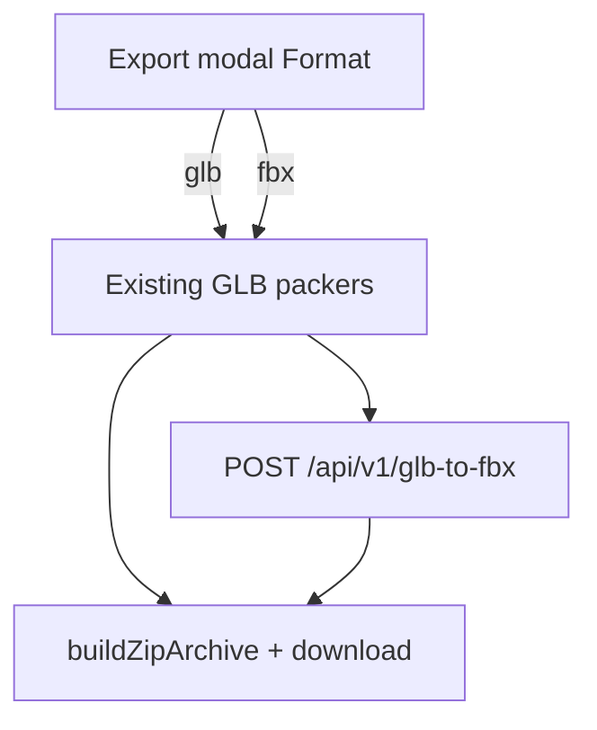

# US-36 — Design (export format GLB | FBX)

## Goal

Let users download the existing export zip as **FBX** when needed (Unity / DCC handoff), while keeping **GLB** as the fast default with no server round-trip.

## UX

`ExportModal` (US-22):

1. Add a **Format** `<Select>`: `glb` | `fbx` (labels **GLB** / **FBX**)
2. Default `glb` whenever the modal opens
3. Summary line and zip default basename follow format (`glb-export` vs `fbx-export`)
4. Basename fields stay extension-agnostic; resolve helpers append `.glb` or `.fbx`

## Data flow

1. `downloadExportZip({ …, format: 'glb' | 'fbx' })` — default `'glb'`
2. Resolve units + pack as today (`packModelGlb` / `packMergedModelsGlb` / `packClipGlb`) → in-memory entries with temporary `.glb` names
3. If `format === 'glb'`: resolve final `.glb` names → zip → download (unchanged)
4. If `format === 'fbx'`: for each entry, client service posts the buffer to convert API → replace buffer + rename to `.fbx` → zip → download. Fail any entry → abort entire download (no partial zip)

## Convert API (mirror US-16)

| Piece                                                 | Role                                                                    |
| ----------------------------------------------------- | ----------------------------------------------------------------------- |
| `src/pages/api/v1/glb-to-fbx.ts`                      | `prerender = false`; multipart `file`; return FBX bytes                 |
| `export/adapters/convert-glb-to-fbx.ts` (server-only) | Write tmp GLB → Assimp (or locked CLI) → read FBX; validate name + size |
| `export/services/ensure-fbx-file.ts` (client)         | `fetch` convert endpoint; map errors for the modal                      |

Constraints (same class as US-16):

- Vercel Node, not Edge; Linux binary via `includeFiles`; Darwin/Windows `excludeFiles`
- Cap ~4.5MB per request body
- Cleanup `os.tmpdir()` always

**Not** `fbx2gltf` — that binary is one-way FBX → glTF.

## Naming

Extend `export/utils/file-name.ts`:

- `resolveExportFileName(raw, fallback, format)` — sanitize basename; append `.glb` or `.fbx`
- Keep `resolveGlbFileName` as a thin wrapper or deprecate callers toward the format-aware helper
- Shared animation-only entries: library name + format extension

## Layering

| Layer                        | Placement                            |
| ---------------------------- | ------------------------------------ |
| Modal Format state           | `export/components/export-modal.tsx` |
| Options + pack orchestration | `export/domain/zip-download.ts`      |
| HTTP to convert API          | `export/services/`                   |
| Native CLI + tmp I/O         | `export/adapters/`                   |
| API route                    | `src/pages/api/v1/glb-to-fbx.ts`     |

Do not put convert HTTP in `domain/`. Do not put Assimp in the client bundle.

## Failure modes

- Convert 400 / 413 / 500 → Export modal `error` string; zip not started
- Network failure → same
- Empty pack → existing “Nothing to pack”

## Fidelity / product honesty

MVP bar: mesh + skeleton + animations export in a form that common DCCs / engines can open. Editor group manifest (`threeEditorModelGroup`) and perfect FBX ↔ GLB round-trip are **not** required. Document in UI or design note that FBX is a convert of the packed GLB.

## Fold into current on ship

- Soften US-5 “no server round-trip” to: GLB = browser-only; FBX = pack then convert
- Extend US-22 modal acceptance with Format
- Assets table: export FBX via convert API
- Out of scope: “FBX convert via US-16 is the only server round-trip” → import + optional FBX export
- CHANGELOG row **US-36**; delete this folder
