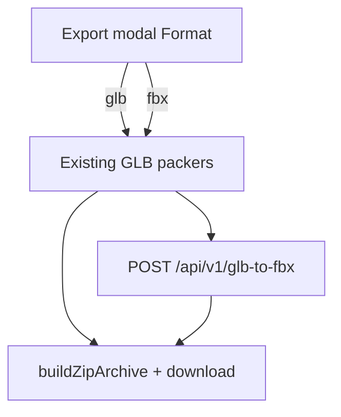

# US-36 — Design (export format GLB | FBX)

## Goal

Let users download the existing export zip as **FBX** when needed (Unity / DCC handoff), while keeping **GLB** as the fast default with no server round-trip.

## UX

`ExportModal` (US-22):

1. Add a **Format** `<Select>`: `glb` | `fbx` (labels **GLB** / **FBX**)
2. Default `glb` whenever the modal opens
3. Summary line and zip default basename follow format (`glb-export` vs `fbx-export`)
4. Basename fields stay extension-agnostic; resolve helpers append `.glb` or `.fbx`

## Data flow



1. `downloadExportZip({ …, format: 'glb' | 'fbx' })` — default `'glb'`
2. Resolve units + pack as today (`packModelGlb` / `packMergedModelsGlb` / `packClipGlb`) → in-memory entries with temporary `.glb` names
3. If `format === 'glb'`: resolve final `.glb` names → zip → download (unchanged)
4. If `format === 'fbx'`: for each entry, client service posts the buffer to convert API → replace buffer + rename to `.fbx` → zip → download. Fail any entry → abort entire download (no partial zip)

## Convert API (mirror US-16)

| Piece                                                 | Role                                                                                              |
| ----------------------------------------------------- | ------------------------------------------------------------------------------------------------- |
| `src/pages/api/v1/glb-to-fbx.ts`                      | `prerender = false`; multipart `file`; return FBX bytes                                           |
| `export/adapters/convert-glb-to-fbx.ts` (server-only) | `libassimp` `convert({ name, bytes }, { to: 'fbx' })` with **WASM** backend; validate name + size |
| `export/services/ensure-fbx-file.ts` (client)         | `fetch` convert endpoint; map errors for the modal                                                |

### Locked converter — `libassimp@0.3.0` (Assimp WASM)

**Why not a Linux Assimp CLI / NAPI addon alone?** There is no `fbx2gltf`-style single package that ships every OS binary. `libassimp` optional NAPI addons (`libassimp-linux-x64-gnu`, etc.) are OS-gated and cannot be installed on Darwin for a Mac → Vercel `includeFiles` path. WASM ships inside `libassimp` on every host.

| Item     | Pin                                                                                                                                                                   |
| -------- | --------------------------------------------------------------------------------------------------------------------------------------------------------------------- |
| npm      | `libassimp@0.3.0` (exact)                                                                                                                                             |
| Call     | `createAssimp({ backend: 'wasm' })` then `convert({ name: 'input.glb', bytes }, { to: 'fbx' })` — or the default `convert` after forcing wasm on the adapter instance |
| Engine   | Assimp (FBX binary export); Node ≥ 22.14                                                                                                                              |
| Artifact | `node_modules/libassimp/dist/wasm/libassimp.wasm` (~11 MB)                                                                                                            |

**Vercel packaging** (`astro.config.mjs`, same NFT pattern as US-16):

```
ssr: { external: ['fbx2gltf', 'libassimp'] },
adapter: vercel({
  includeFiles: [
    './node_modules/fbx2gltf/bin/Linux/FBX2glTF',
    './node_modules/libassimp/dist/wasm/libassimp.wasm',
  ],
  excludeFiles: [
    './node_modules/fbx2gltf/bin/Darwin/FBX2glTF',
    './node_modules/fbx2gltf/bin/Windows_NT/FBX2glTF.exe',
    './node_modules/libassimp-darwin-arm64/libassimp.darwin-arm64.node',
    './node_modules/libassimp-linux-x64-gnu/libassimp.linux-x64-gnu.node',
    './node_modules/libassimp-win32-x64-msvc/libassimp.win32-x64-msvc.node',
  ],
}),
```

Optional NAPI addons may still install locally for other tooling; the convert adapter **must** use `backend: 'wasm'` so production never depends on a missing `.node`. Exclude those addons from the serverless bundle.

Constraints (same class as US-16):

- Vercel Node, not Edge; WASM via `includeFiles`; optional NAPI addons in `excludeFiles`
- Cap ~4.5MB per request body
- Prefer in-memory convert (no tmpdir required); tmpdir OK if the adapter writes for debugging
- Do not put `libassimp` in the client bundle

**Not** `fbx2gltf` — that binary is one-way FBX → glTF.

## Naming

Extend `export/utils/file-name.ts`:

- `resolveExportFileName(raw, fallback, format)` — sanitize basename; append `.glb` or `.fbx`
- Keep `resolveGlbFileName` as a thin wrapper or deprecate callers toward the format-aware helper
- Shared animation-only entries: library name + format extension

## Layering

| Layer                                           | Placement                            |
| ----------------------------------------------- | ------------------------------------ |
| Modal Format state                              | `export/components/export-modal.tsx` |
| Options + pack orchestration                    | `export/domain/zip-download.ts`      |
| HTTP to convert API                             | `export/services/`                   |
| Native CLI / Assimp WASM + tmp or in-memory I/O | `export/adapters/`                   |
| API route                                       | `src/pages/api/v1/glb-to-fbx.ts`     |

Do not put convert HTTP in `domain/`. Do not put Assimp in the client bundle.

## Failure modes

- Convert 400 / 413 / 500 → Export modal `error` string; zip not started
- Network failure → same
- Empty pack → existing “Nothing to pack”

## Fidelity / product honesty

MVP bar: mesh + skeleton + animations export in a form that common DCCs / engines can open. Editor group manifest (`threeEditorModelGroup`) and perfect FBX ↔ GLB round-trip are **not** required. Document in UI or design note that FBX is a convert of the packed GLB.

## Fold into current on ship

- Soften US-5 “no server round-trip” to: GLB = browser-only; FBX = pack then convert
- Extend US-22 modal acceptance with Format
- Assets table: export FBX via convert API
- Out of scope: “FBX convert via US-16 is the only server round-trip” → import + optional FBX export
- CHANGELOG row **US-36**; delete this folder
